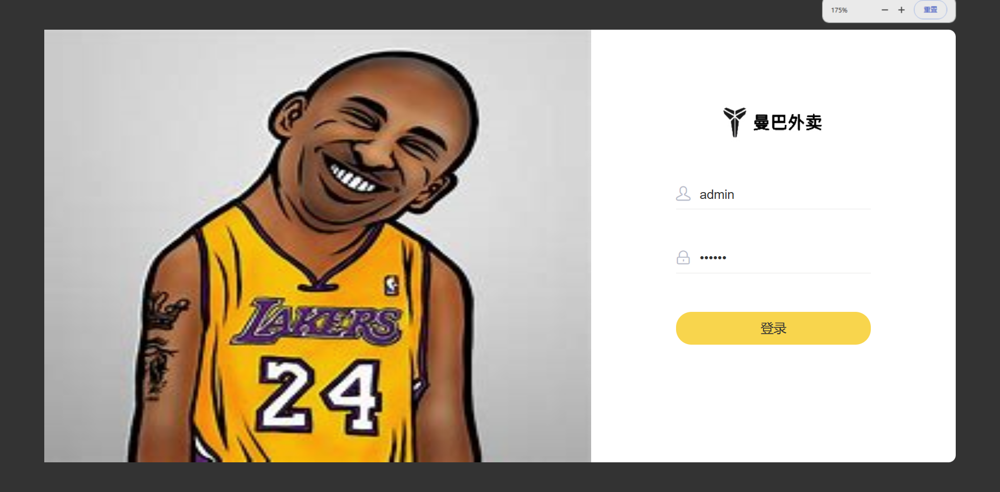
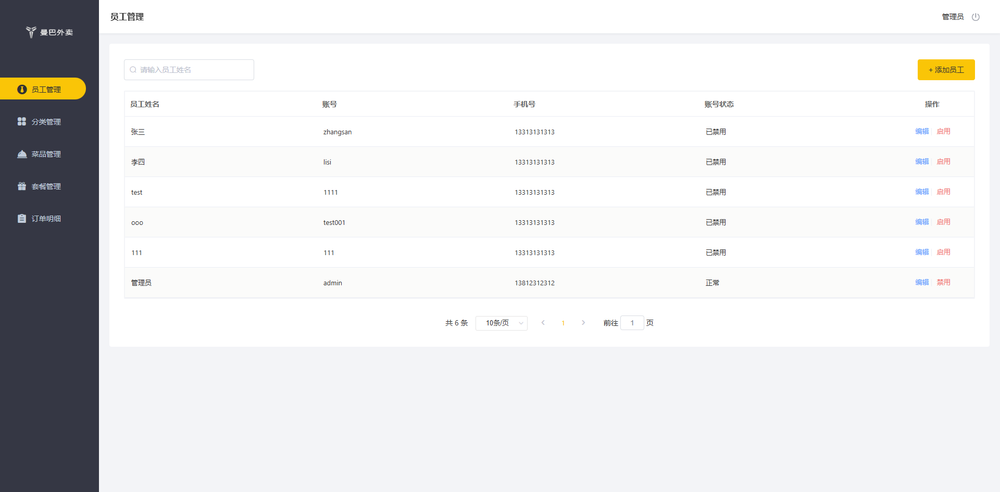
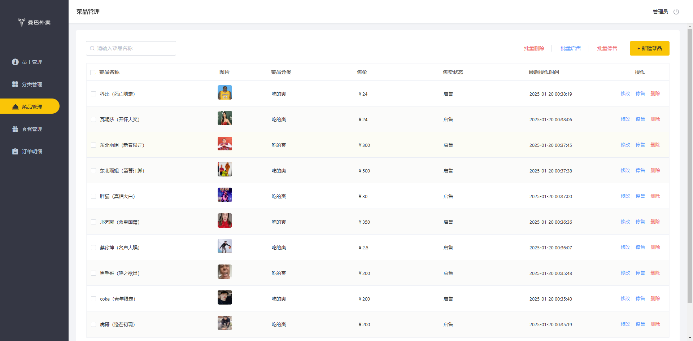
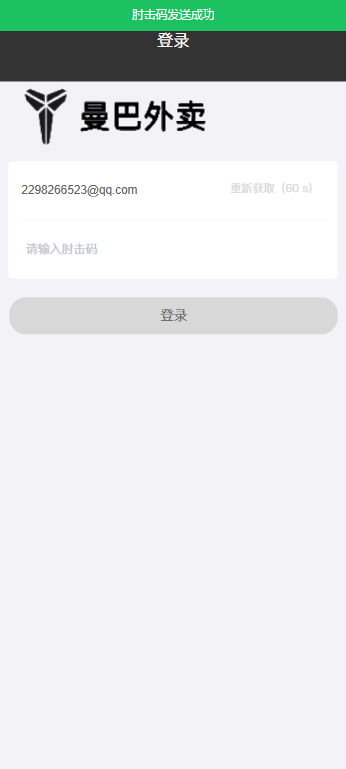
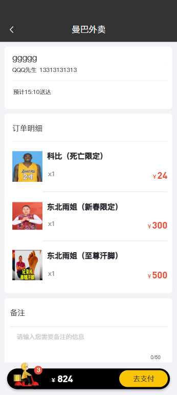
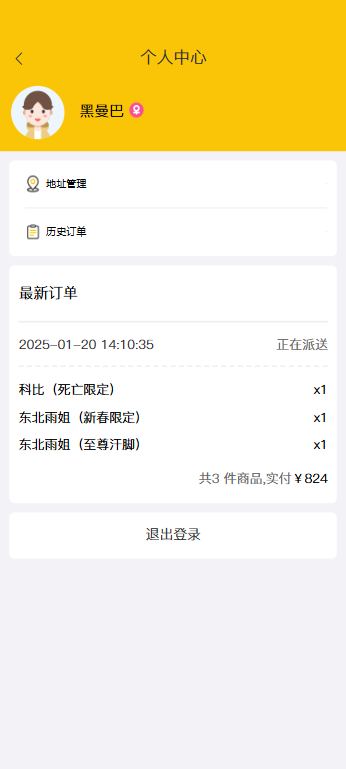
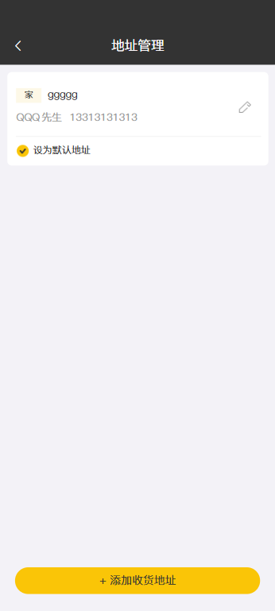
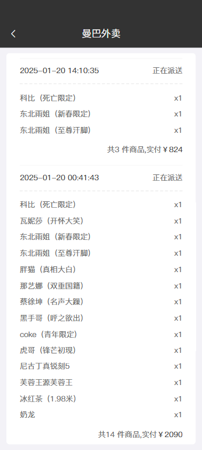
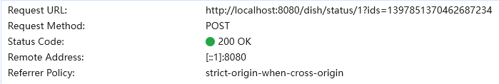
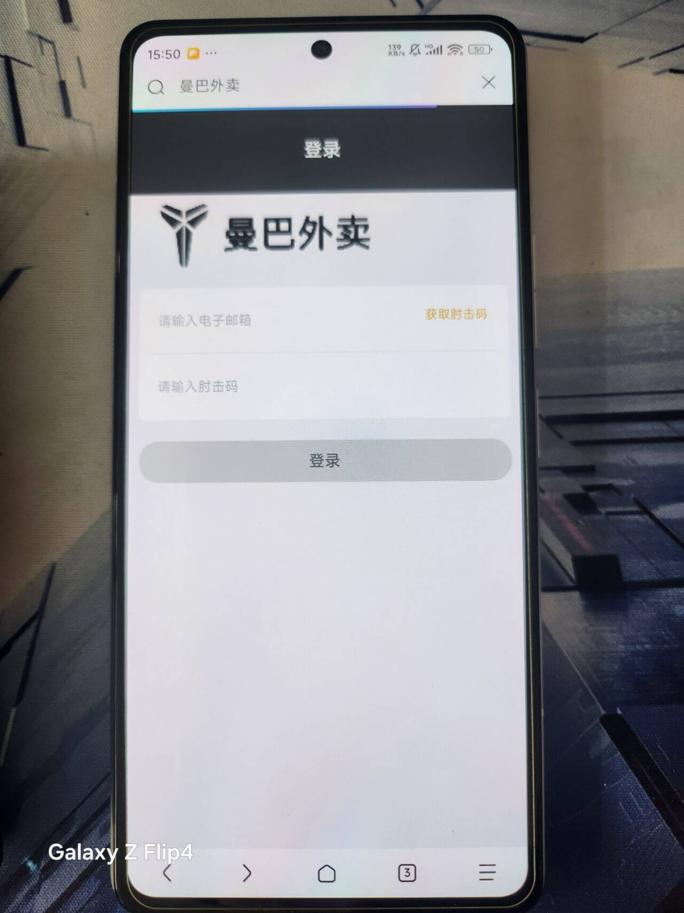

# 曼巴外卖(瑞吉外卖)

懒得翻身的咸鱼

------


# 前言

- 本项目《曼巴外卖》是基于黑马《瑞吉外卖》改名换皮而来，感谢黑马贡献的高质量视频教程。
- 本项目将短信登录改造成了邮箱登录。

> - 黑马《瑞吉外卖》视频教程连接：[黑马程序员Java项目实战《瑞吉外卖》，轻松掌握springboot + mybatis plus开发核心技术的真java实战项目](https://www.bilibili.com/video/BV13a411q753?p=1&vd_source=ff1f70c9f263d908963cefc562648f80)
> - 本文项目完整源码链接：https://github.com/xianyu2298/ManBa.git

# 软件开发整体介绍

- 本项目是一个单体架构，没有使用微服务。

# 与瑞吉外卖有什么区别？

曼巴外卖与瑞吉并没有什么太大区别，只是改名换图标，完善了教程中没有的功能而已......

## 已完善教程中没有的功能：

- 菜品停售起售功能（包含批量）
- 菜品的删除和批量删除功能（逻辑删除）
- 验证码登录替换为邮箱登录
- 将一个菜品移出购物车以及清空购物车功能
- 后台订单管理业务（加用户端订单详情页）

## 未完善的功能：

- 后台端的非管理员用户不可调整其他用户的状态以及菜品和套餐的增删
- More......

马上过年了，狗都不写了，等有空再完善吧......

# 项目展示（部分截图）

## 后台端







## 用户端












# 完善部分的代码

## 菜品的停售和起售功能

其实前端已经写好了，接口是万金油

发送POST请求，请求地址如图（起售）



停售和起售的请求地址不一样，故在控制器DishController中编写两个方法

### 控制层DishController.java

```java
/**
     * 将商品停售
     * @param ids
     * @return
     */
    @PostMapping("/status/0")
    public R<Boolean> stopSell(String ids){

        if (StringUtils.isBlank(ids)){
            return R.error("参数传递不正确！");
        }
        boolean result = dIshService.stopSell(ids);
        if (!result){
            R.error("停售失败");
        }
        return R.success(true);
    }

```

```java
/**
     * 将商品起售
     * @param ids
     * @return
     */
    @PostMapping("/status/1")
    public R<Boolean> startSell(String ids){

        if (StringUtils.isBlank(ids)){
            return R.error("参数传递不正确！");
        }
        boolean result = dIshService.startSell(ids);
        if (!result){
            R.error("起售失败");
        }
        return R.success(true);
    }
```

### 服务层DishService.java

```java
	//菜品停售
    boolean stopSell(String ids);
    //菜品起售
    boolean startSell(String ids);
```

### 服务层接口实现类DishServiceImpl.java

```java
@Override
    public boolean stopSell(String ids) {

        List<Long> idList = Arrays.asList(ids.split(","))
                .stream()
                .map(Long::parseLong)
                .collect(Collectors.toList());

        idList.forEach(id ->{
            Dish dish = dishMapper.selectById(id);
            Integer dishStatus = dish.getStatus();
            if (dishStatus == 1){
                dish.setStatus(0);
                this.updateById(dish);
            }else {
                log.error(id+"停售失败！");
            }
        });

        return true;
    }

    @Override
    public boolean startSell(String ids) {
        List<Long> idList = Arrays.asList(ids.split(","))
                .stream()
                .map(Long::parseLong)
                .collect(Collectors.toList());

        idList.forEach(id ->{
            Dish dish = dishMapper.selectById(id);
            Integer dishStatus = dish.getStatus();
            if (dishStatus == 0){
                dish.setStatus(1);
                this.updateById(dish);
            }else {
                log.error(id+"停售失败！");
            }
        });

        return true;
    }

```

## 菜品的删除和批量删除功能（逻辑删除）

一个个说明太麻烦了，直接给代码

### 实体类Dish.java

```java
@TableLogic(value = "0",delval = "1")
    //是否删除(逻辑删除)
    private Integer isDeleted;
```

### 服务接口DishService.java

```java
    //删除和批量删除菜品信息
	public void remove(String ids);
}
```

### 服务层接口实现类DishServiceImpl.java

```java
    /**
     * 删除菜品
     * @param ids
     */
    @Override
    public void remove(String ids) {
        String[] id = ids.split(",");
        try {
            for (int i = 0;i < id.length; i++){
                dishMapper.deleteById(Long.valueOf(id[i]));
            }
        }catch (Exception e){
            System.out.println(e.getMessage());
        }
    }
```

## 验证码登录替换为邮箱登录

这个可就麻烦了

首先你得把你邮箱的SMTP口令获取到，以QQ邮箱为例

进入QQ邮箱-设置-账号-POP3/IMAP/SMTP/Exchange/CardDAV/CalDAV服务-开启服务

服务开启后你就有了16位的SMTP口令，现在我们来搓代码

### MySQL

用户登录涉及到数据表 `user` ，笔者这里把字段 `phone` 重命名成了 `email` ，没有改变字段的数据类型，以对应用户的邮箱

```mysql
ALTER TABLE `user`
CHANGE phone email VARCHAR(100);
```

### 后端开发

针对数据表 `user` 把对应的实体类、数据层、业务层和控制层的代码写出

#### 实体类User.java

```java
package ocm.itheima.reggie.entity;

import com.fasterxml.jackson.databind.annotation.JsonSerialize;
import com.fasterxml.jackson.databind.ser.std.ToStringSerializer;
import lombok.Data;
import java.time.LocalDateTime;
import java.util.Date;
import java.util.List;
import java.io.Serializable;
import com.baomidou.mybatisplus.annotation.IdType;
import com.baomidou.mybatisplus.annotation.TableId;
/**
 * 用户信息
 */
@Data
public class User implements Serializable {
	private static final long serialVersionUID = 2L;
    @JsonSerialize(using =  ToStringSerializer.class)
    private Long id;
    //姓名
    private String name;
    //手机号
    private String email;
    //性别 0 女 1 男
    private String sex;
    //身份证号
    private String idNumber;
    //头像
    private String avatar;
	//状态 0:禁用，1:正常
    private Integer status;
}

```

#### 数据层UserMapper.java

```java
package ocm.itheima.reggie.mapper;

import com.baomidou.mybatisplus.core.mapper.BaseMapper;
import ocm.itheima.reggie.entity.User;
import org.apache.ibatis.annotations.Mapper;

@Mapper
public interface UserMapper extends BaseMapper<User>{
}

```

#### 服务层IUserService.java

```java
package ocm.itheima.reggie.service;

import com.baomidou.mybatisplus.extension.service.IService;
import ocm.itheima.reggie.entity.User;

import javax.mail.MessagingException;
import javax.servlet.http.HttpSession;
import java.util.Map;

public interface IUserService extends IService<User> {

    // 发送邮箱验证码
    Boolean sendMsg(User user, HttpSession session) throws MessagingException;

    // 移动端用户登录
    User login(Map<String, String> map, HttpSession session);

    // 移动端用户退出登录
    Boolean logout(HttpSession session);
}
```

#### 服务层接口实现类UserServiceImpl.java

```java
package ocm.itheima.reggie.service.impl;

import com.baomidou.mybatisplus.core.conditions.query.LambdaQueryWrapper;
import com.baomidou.mybatisplus.extension.service.impl.ServiceImpl;
import ocm.itheima.reggie.common.BaseContext;
import ocm.itheima.reggie.common.CustomExpection;
import ocm.itheima.reggie.entity.User;
import ocm.itheima.reggie.mapper.UserMapper;
import ocm.itheima.reggie.service.IUserService;
import ocm.itheima.reggie.utils.MailUtils;
import org.springframework.stereotype.Service;

import javax.mail.MessagingException;
import javax.servlet.http.HttpSession;
import java.util.Map;

@Service

public class UserServiceImpl extends ServiceImpl<UserMapper, User> implements IUserService {
    // 发送邮箱验证码
    @Override
    public Boolean sendMsg(User user, HttpSession session) throws MessagingException {
        // 1.获取前端传来的用户邮箱
        String email = user.getEmail();
        // 2.如果邮箱不为空才进行下一步操作
        if (!email.isEmpty()) {
            // 2.1 随机生成六位数验证码
            String code = MailUtils.getCode();
            // 2.2 发送验证码邮件
            MailUtils.sendMail(email, code);
            // 2.3 把获得的验证码存入session保存作用域，方便后面拿出来比对
            session.setAttribute(email, code);
            return true;
        }
        return false;
    }

    // 移动端用户登录登录
    @Override
    public User login(Map<String, String> map, HttpSession session) {
        // 获取前端传送来的用户邮箱
        String email = map.get("email");
        // 获取前端传送来的验证码
        String code = map.get("code");
        // 验证邮箱和验证码是否为空，如果为空则直接登录失败
        if (email.isEmpty() || code.isEmpty()) {
            throw new CustomExpection("邮箱或肘击码不能为空");
        }

        // 如果邮箱和验证码不为空，前往调用数据层查询数据库有无该用户
        // 获取之前存在session保存作用域中的正确验证码
        String trueCode = (String) session.getAttribute(email);

        // 比对用户输入的验证码和真实验证码，错了直接登录失败
        if (!code.equals(trueCode)) {
            throw new CustomExpection("肘击码错误");
        }

        // 验证码匹配，开始调用数据库查询
        LambdaQueryWrapper<User> lqw = new LambdaQueryWrapper<>();
        lqw.eq(User::getEmail, email);
        User user = this.getOne(lqw);

        // 如果数据库中没有该用户，就是新用户，要添加新用户
        if (user == null) {
            // 添加新用户
            user = new User();
            user.setEmail(email);
            this.save(user);
        }
        // 最后把这个登录用户存到session保存作用域中，表示已登录，让拦截器放行
        session.setAttribute("user", user.getId());
        return user;
    }

    // 移动端用户退出登录
    @Override
    public Boolean logout(HttpSession session) {
        Long userId = BaseContext.getCurrentId();
        User user = this.getById(userId);
        String email = user.getEmail();
        // 清除Session保存作用域中保存的数据
        session.removeAttribute("user");
        session.removeAttribute(email);
        return true;
    }
}
```

#### 控制层UserController.java

```java
package ocm.itheima.reggie.controller;

import lombok.extern.slf4j.Slf4j;
import ocm.itheima.reggie.common.R;
import ocm.itheima.reggie.entity.User;
import ocm.itheima.reggie.service.IUserService;
import ocm.itheima.reggie.service.impl.UserServiceImpl;
import org.springframework.beans.factory.annotation.Autowired;
import org.springframework.web.bind.annotation.PostMapping;
import org.springframework.web.bind.annotation.RequestBody;
import org.springframework.web.bind.annotation.RequestMapping;
import org.springframework.web.bind.annotation.RestController;

import javax.mail.MessagingException;
import javax.servlet.http.HttpSession;
import java.util.Map;

@RestController
@Slf4j
@RequestMapping("/user")
public class UserController {


    @Autowired
    private IUserService userService;

    @PostMapping("/sendMsg")
    public R<String> sendMsg(@RequestBody User user, HttpSession session) throws MessagingException {
        if (userService.sendMsg(user, session)) {
            return R.success("肘击码发送成功");
        }
        return R.error("肘击码发送失败");
    }

    // 移动端用户登录登录
    @PostMapping("/login")
    public R<User> login(@RequestBody Map<String, String> map, HttpSession session) {
        User user = userService.login(map, session);
        return R.success(user);
    }

    // 移动端用户退出登录
    @PostMapping("/loginout")
    public R<String> logout(HttpSession session) {
        if (userService.logout(session)) {
            return R.success("退出成功");
        }
        return R.error("退出失败");
    }
}
```

#### 工具类MailUtils

```java
package ocm.itheima.reggie.utils;

import lombok.extern.slf4j.Slf4j;

import javax.mail.*;
import javax.mail.internet.InternetAddress;
import javax.mail.internet.MimeMessage;
import java.util.Arrays;
import java.util.Collections;
import java.util.List;
import java.util.Properties;
@Slf4j

public class MailUtils {

    // 发送邮件验证码
    public static void sendMail(String email, String code) throws MessagingException {
        // 1.创建Properties 类用于记录邮箱的一些属性
        Properties pros = new Properties();
        // 1.1 表示SMTP发送邮件，必须进行身份验证
        pros.put("mail.smtp.auth", "true");
        // 1.2 此处填写SMTP服务器
        pros.put("mail.smtp.host", "smtp.qq.com");
        // 1.3 使用端口587用于TLS，或者465用于SSL
        pros.put("mail.smtp.port", "587");  // 使用TLS
        // 启用starttls加密
        pros.put("mail.smtp.starttls.enable", "true");  // 启用TLS

        // pros.put("mail.smtp.port", "465");  // 如果使用SSL
        // pros.put("mail.smtp.ssl.enable", "true");  // 启用SSL（如果使用465端口）

        // 1.4 此处填写，写信人的账号
        pros.put("mail.user", "2298266523@qq.com");
        // 1.5 此处填写16位STMP口令
        pros.put("mail.password", "dhujbkjeewckdjgh");

        // 2.构建授权信息，用于进行SMTP进行身份验证
        Authenticator authenticator = new Authenticator() {
            protected javax.mail.PasswordAuthentication getPasswordAuthentication() {
                // 2.1 用户名
                String userName = pros.getProperty("mail.user");
                // 2.2 16位STMP口令
                String password = pros.getProperty("mail.password");
                return new javax.mail.PasswordAuthentication(userName, password);
            }
        };

        // 3.使用环境属性和授权信息，创建邮件会话
        Session mailSession = Session.getInstance(pros, authenticator);
        // 4.创建邮件消息对象
        MimeMessage message = new MimeMessage(mailSession);
        // 4.1 设置发件人
        InternetAddress from = new InternetAddress(pros.getProperty("mail.user"));
        message.setFrom(from);
        // 4.2 设置收件人
        InternetAddress to = new InternetAddress(email);
        message.setRecipient(Message.RecipientType.TO, to);
        // 4.3 设置邮件标题
        message.setSubject("【曼巴外卖】邮箱登录验证码");
        // 4.4 设置邮件的正文
        message.setContent("尊敬的用户：您好！\r\n您的登录验证码为：" + code + "（有效期为一分钟）", "text/html;charset=UTF-8");

        // 5.最后，发送邮件
        Transport.send(message);
        log.info("肘击码：{}",code);
    }

    // 获取六位随机验证码

    public static String getCode() {
        // 由于数字 1 、 0 和字母 O 、l 有时分不清楚，所以，没有数字 1 、 0
        String[] beforeShuffle = {"2", "3", "4", "5", "6", "7", "8", "9", "A", "B", "C", "D", "E", "F",
                "G", "H", "I", "J", "K", "L", "M", "N", "O", "P", "Q", "R", "S", "T", "U", "V", "W", "X", "Y", "Z", "a",
                "b", "c", "d", "e", "f", "g", "h", "i", "j", "k", "l", "m", "n", "o", "p", "q", "r", "s", "t", "u", "v",
                "w", "x", "y", "z"};
        // 将数组转换成集合
        List<String> list = Arrays.asList(beforeShuffle);
        // 打乱集合顺序，以达到随机的效果
        Collections.shuffle(list);
        // 创建StringBuilder，不是线程安全的
        StringBuilder sb = new StringBuilder();
        // 将集合转变成StringBuilder字符串
        for (String s : list) {
            sb.append(s);
        }
        // 返回sb字符串中第10~17位的5位验证码，这个区间其实随便设的
        return sb.substring(10, 16);

    }
}
```

#### 修改拦截器LoginCheckFilter.java

添加不需要拦截到URL地址

```java
"/user/login",      // 用户登录
"/user/sendMsg"     //验证码发送
```

并再添加一段代码，用于判断 C 端用户是否已经登录

```java
// 6.如果需要处理，判断C端用户是否登录
        if (request.getSession().getAttribute("user") != null) {
            // 能进入说明已经登录，直接放行
            Long userId = (Long) request.getSession().getAttribute("user");
            log.info("邮箱用户{}已登录", userId);

            // 把当前登录用户的ID保存到ThreadLocal中
            BaseContext.setCurrentId(userId);

            // 放行
            filterChain.doFilter(request, response);
            return;
        }
```

#### 导入Maven依赖

```xml
<dependency>
    <groupId>javax.activation</groupId>
    <artifactId>activation</artifactId>
    <version>1.1.1</version>
</dependency>

<!-- https://mvnrepository.com/artifact/javax.mail/mail -->
<dependency>
    <groupId>javax.mail</groupId>
    <artifactId>mail</artifactId>
    <version>1.4.7</version>
</dependency>

<!-- https://mvnrepository.com/artifact/org.apache.commons/commons-email -->
<dependency>
    <groupId>org.apache.commons</groupId>
    <artifactId>commons-email</artifactId>
    <version>1.4</version>
</dependency>
```

### 修改前端代码

- 在开发代码之前，需要梳理一下登录时前端页面和服务端的交互过程：
    - 1、在登录页面 (front/page/login.html) 输入电子邮箱，点击【获取验证码】按钮，页面发送 ajax 请求，在服务端调用邮箱服务 API 给指定邮箱发送验证码邮件；
    - 2、在登录页面输入验证码，点击【登录】按钮，发送 ajax 请求，在服务端处理登录请求。
- 开发邮箱验证码登录功能，其实就是在服务端编写代码去处理前端页面发送的这 2 次请求即可。

##### 用户登录页面修改

###### 	修改front/api/login.js，添加获取邮箱验证码的函数

```javascript
function sendMsgApi(data) {
    return $axios({
        'url': '/user/sendMsg',
        'method': 'post',
        data
    })
}
```

###### 	修改/front/page/login.html

```html
<!DOCTYPE html>
<html lang="en">
    <head>
        <meta charset="utf-8">
        <meta http-equiv="X-UA-Compatible" content="IE=edge">
        <!-- 上述3个meta标签*必须*放在最前面，任何其他内容都*必须*跟随其后！ -->
        <meta name="viewport" content="width=device-width, initial-scale=1.0, maximum-scale=1.0,user-scalable=no,minimal-ui">
        <title>曼巴外卖</title>
        <link rel="icon" href="./../images/favico.ico">
        <!--不同屏幕尺寸根字体设置-->
        <script src="./../js/base.js"></script>
        <!--element-ui的样式-->
        <link rel="stylesheet" href="../../backend/plugins/element-ui/index.css" />
        <!--引入vant样式-->
        <link rel="stylesheet" href="../styles/vant.min.css"/>
        <!-- 引入样式  -->
        <link rel="stylesheet" href="../styles/index.css" />
        <!--本页面内容的样式-->
        <link rel="stylesheet" href="./../styles/login.css" />
      </head>
    <body>
    <div id="login" v-loading="loading">
        <div class="divHead">登录</div>
        <div class="divImg">
            
        </div>
        <div class="divContainer">
            <el-input placeholder=" 请输入电子邮箱" v-model="form.email" maxlength='50'/>
            </el-input>
            <div class="divSplit"></div>
            <el-input placeholder=" 请输入肘击码" v-model="form.code" maxlength='20'/>
            </el-input>

            <span @click='getCode' v-show="show">获取肘击码</span>
            <!--用户点击完【获取验证码】后倒计时60s-->
            <span v-show="!show" class="count">重新获取（{{count}} s）</span>


        </div>
        <div class="divMsg" v-if="msgFlag">邮箱输入不正确，请重新输入</div>
        <el-button type="primary"
                   :class="{btnSubmit:1===1,btnNoPhone:!form.code||!form.email,btnPhone:form.code&&form.email}"
                   @click="btnLogin">
            登录
        </el-button>
    </div>
    <!-- 开发环境版本，包含了有帮助的命令行警告 -->
    <script src="../../backend/plugins/vue/vue.js"></script>
    <!-- 引入组件库 -->
    <script src="../../backend/plugins/element-ui/index.js"></script>
    <!-- 引入vant样式 -->
    <script src="./../js/vant.min.js"></script>
    <!-- 引入axios -->
    <script src="../../backend/plugins/axios/axios.min.js"></script>
    <script src="./../js/request.js"></script>
    <script src="./../api/login.js"></script>
    </body>
    <script>
        new Vue({
            el: "#login",
            data() {
                return {
                    show: true, // 控制【获取验证码】以及倒计时的显示开关
                    count: '',  // 倒计时时长
                    timer: null,    // 计时器
                    form: {
                        email: '',
                        code: ''
                    },
                    msgFlag: false,
                    loading: false
                }
            },
            computed: {},
            created() {
            },
            mounted() {
            },
            methods: {
                getCode() {
                    const TIME_COUNT = 60;  // 验证码倒计时时长60s
                    this.form.code = ''
                    // const regex = /^(13[0-9]{9})|(15[0-9]{9})|(17[0-9]{9})|(18[0-9]{9})|(19[0-9]{9})$/;  // 手机号正则表达式
                    const regex = /^\w+([-+.]\w+)*@\w+([-.]\w+)*\.\w+([-.]\w+)*$/; // 邮箱正则表达式
                    if (regex.test(this.form.email)) {
                        this.msgFlag = false
                        // this.form.code = (Math.random() * 1000000).toFixed(0)
                        const res = sendMsgApi({email: this.form.email})    // 向后端发送用户的邮箱，让后端给用户发送验证码邮件
                        this.$notify({type: 'success', message: '肘击码发送成功'})

                        if (!this.timer) {
                            this.count = TIME_COUNT;    // 设置倒计时时长
                            this.show = false;  // 不显示【获取验证码】，显示倒计时
                            this.timer = setInterval(() => {
                                if (this.count > 0 && this.count <= TIME_COUNT) {
                                    this.count--;
                                } else {    // 倒计完了
                                    this.show = true;   // 不显示倒计时，显示【获取验证码】
                                    clearInterval(this.timer);
                                    this.timer = null;
                                }
                            }, 1000)
                        }
                    } else {
                        this.msgFlag = true
                    }
                },
                async btnLogin() {
                    if (this.form.email && this.form.code) {
                        this.loading = true
                        const res = await loginApi(this.form)
                        this.loading = false
                        if (res.code === 1) {
                            localStorage.setItem('userInfo', JSON.stringify(res.data)) // 存储后端返回的用户对象
                            sessionStorage.setItem("userEmail", this.form.email)
                            window.requestAnimationFrame(() => {
                                this.$notify({type: 'success', message: '登录成功'})
                                window.location.href = '/front/index.html'
                            })
                        } else {
                            this.$notify({type: 'warning', message: res.msg});
                        }
                    }
                    if (!this.form.email) {
                        this.$notify({type: 'warning', message: '请输入电子邮箱'});
                    } else if (!this.form.code) {
                        this.$notify({type: 'warning', message: '请输入肘击码'});
                    }
                }
            }
        })
    </script>
</html>
```

## 将一个菜品移出购物车以及清空购物车功能

### 实体类ShoppingCart.java

```java
package ocm.itheima.reggie.entity;

import lombok.Data;
import java.io.Serializable;
import java.math.BigDecimal;
import java.time.LocalDateTime;

/**
 * 购物车
 */
@Data
public class ShoppingCart implements Serializable {

    private static final long serialVersionUID = 1L;

    private Long id;

    //名称
    private String name;

    //用户id
    private Long userId;

    //菜品id
    private Long dishId;

    //套餐id
    private Long setmealId;

    //口味
    private String dishFlavor;

    //数量
    private Integer number;

    //金额
    private BigDecimal amount;

    //图片
    private String image;

    private LocalDateTime createTime;
}
```

### 数据层ShoppingCartMapper.java

```java
package ocm.itheima.reggie.mapper;

import com.baomidou.mybatisplus.core.mapper.BaseMapper;
import ocm.itheima.reggie.entity.ShoppingCart;
import org.apache.ibatis.annotations.Mapper;
import org.apache.ibatis.annotations.Select;

import java.util.List;

@Mapper
public interface ShoppingCartMapper extends BaseMapper<ShoppingCart> {

}
```

### 服务层ShippingCartService.java

```JAVA
package ocm.itheima.reggie.service;

import com.baomidou.mybatisplus.extension.service.IService;
import ocm.itheima.reggie.entity.ShoppingCart;

public interface ShoppingCartService extends IService<ShoppingCart> {
    // 购物车商品减一
    Boolean sub(ShoppingCart shoppingCart);
}
```

### 服务层接口实现类ShoppingCartServiceImpl.java

```JAVA
package ocm.itheima.reggie.service.impl;

import com.baomidou.mybatisplus.core.conditions.query.LambdaQueryWrapper;
import com.baomidou.mybatisplus.extension.service.impl.ServiceImpl;
import ocm.itheima.reggie.common.BaseContext;
import ocm.itheima.reggie.entity.ShoppingCart;
import ocm.itheima.reggie.mapper.ShoppingCartMapper;
import ocm.itheima.reggie.service.ShoppingCartService;
import org.springframework.stereotype.Service;

@Service
public class ShoppingCartServiceImpl extends ServiceImpl<ShoppingCartMapper, ShoppingCart> implements ShoppingCartService {
    // 购物车商品减一
    @Override
    public Boolean sub(ShoppingCart shoppingCart) {
        // 1.获取当前用户ID
        Long userId = BaseContext.getCurrentId();
        // 2.创建查询条件封装器
        LambdaQueryWrapper<ShoppingCart> lqw = new LambdaQueryWrapper<>();
        // 2.1 添加查询添加：按用户ID查询
        lqw.eq(userId != null, ShoppingCart::getUserId, userId);

        // 3.判断传来的是菜品还是套餐
        if (shoppingCart.getDishId() != null) {
            // 3.1 删除的是菜品
            lqw.eq(ShoppingCart::getDishId, shoppingCart.getDishId());
        } else {
            // 3.2 删除的是套餐
            lqw.eq(ShoppingCart::getSetmealId, shoppingCart.getSetmealId());
        }

        // 4.查询当前购物车里该菜品/套餐的数量
        ShoppingCart shoppingCartSel = this.getOne(lqw);
        if (1 < shoppingCartSel.getNumber()) {
            // 4.1 数量大于一，直接减一
            shoppingCartSel.setNumber(shoppingCartSel.getNumber() - 1);
            // 4.2更新到数据库
            return this.updateById(shoppingCartSel);
        }

        // 5.其他情况直接从购物车删除此商品
        return this.remove(lqw);
    }
}
```

### 控制层ShoppingCartController.java

```JAVA
package ocm.itheima.reggie.controller;

import com.baomidou.mybatisplus.core.conditions.query.LambdaQueryWrapper;
import ocm.itheima.reggie.common.BaseContext;
import ocm.itheima.reggie.common.R;
import ocm.itheima.reggie.entity.ShoppingCart;
import ocm.itheima.reggie.service.ShoppingCartService;
import lombok.extern.slf4j.Slf4j;
import org.springframework.beans.factory.annotation.Autowired;
import org.springframework.web.bind.annotation.*;

import java.time.LocalDateTime;
import java.util.List;

/**
 * 购物车
 */
@Slf4j
@RestController
@RequestMapping("/shoppingCart")
public class ShoppingCartController {

    @Autowired
    private ShoppingCartService shoppingCartService;

    /**
     * 添加购物车
     * @param shoppingCart
     * @return
     */
    @PostMapping("/add")
    public R<ShoppingCart> add(@RequestBody ShoppingCart shoppingCart){
        log.info("购物车数据:{}",shoppingCart);

        //设置用户id，指定当前是哪个用户的购物车数据
        Long currentId = BaseContext.getCurrentId();
        shoppingCart.setUserId(currentId);

        Long dishId = shoppingCart.getDishId();

        LambdaQueryWrapper<ShoppingCart> queryWrapper = new LambdaQueryWrapper<>();
        queryWrapper.eq(ShoppingCart::getUserId,currentId);

        if(dishId != null){
            //添加到购物车的是菜品
            queryWrapper.eq(ShoppingCart::getDishId,dishId);

        }else{
            //添加到购物车的是套餐
            queryWrapper.eq(ShoppingCart::getSetmealId,shoppingCart.getSetmealId());
        }

        //查询当前菜品或者套餐是否在购物车中
        //SQL:select * from shopping_cart where user_id = ? and dish_id/setmeal_id = ?
        ShoppingCart cartServiceOne = shoppingCartService.getOne(queryWrapper);

        if(cartServiceOne != null){
            //如果已经存在，就在原来数量基础上加一
            Integer number = cartServiceOne.getNumber();
            cartServiceOne.setNumber(number + 1);
            shoppingCartService.updateById(cartServiceOne);
        }else{
            //如果不存在，则添加到购物车，数量默认就是一
            shoppingCart.setNumber(1);
            shoppingCart.setCreateTime(LocalDateTime.now());
            shoppingCartService.save(shoppingCart);
            cartServiceOne = shoppingCart;
        }

        return R.success(cartServiceOne);
    }

    /**
     * 查看购物车
     * @return
     */
    @GetMapping("/list")
    public R<List<ShoppingCart>> list(){
        log.info("查看购物车...");

        LambdaQueryWrapper<ShoppingCart> queryWrapper = new LambdaQueryWrapper<>();
        queryWrapper.eq(ShoppingCart::getUserId,BaseContext.getCurrentId());
        queryWrapper.orderByAsc(ShoppingCart::getCreateTime);

        List<ShoppingCart> list = shoppingCartService.list(queryWrapper);

        return R.success(list);
    }

    /**
     * 清空购物车
     * @return
     */
    @DeleteMapping("/clean")
    public R<String> clean(){
        //SQL:delete from shopping_cart where user_id = ?

        LambdaQueryWrapper<ShoppingCart> queryWrapper = new LambdaQueryWrapper<>();
        queryWrapper.eq(ShoppingCart::getUserId,BaseContext.getCurrentId());

        shoppingCartService.remove(queryWrapper);

        return R.success("清空购物车成功");
    }
    // 购物车商品减一
    @PostMapping("/sub")
    public R<String> sub(@RequestBody ShoppingCart shoppingCart) {
        if (shoppingCartService.sub(shoppingCart)) {
            return R.success("删除成功");
        }
        return R.error("删除失败");
    }
}
```

## 后台订单管理业务（加用户端订单详情页）

### 服务层OrderService.java

```java
package ocm.itheima.reggie.service;

import com.baomidou.mybatisplus.extension.plugins.pagination.Page;
import com.baomidou.mybatisplus.extension.service.IService;
import ocm.itheima.reggie.dto.OrderDto;
import ocm.itheima.reggie.entity.Orders;

public interface OrderService extends IService<Orders> {

    /**
     * 用户下单
     * @param orders
     */
    public void submit(Orders orders);

    // 获取订单分页展示
    Page<OrderDto> getPage(Long page, Long pageSize);

    // 后台管理端获取订单分页展示
    Page<OrderDto> getAllPage(Long page, Long pageSize, String number, String beginTime, String endTime);

    // 修改订单状态
    Boolean update(Orders order);
}
```


### 服务层接口实现类OrderServiceImpl.java

```java
package ocm.itheima.reggie.service.impl;

import com.baomidou.mybatisplus.core.conditions.query.LambdaQueryWrapper;
import com.baomidou.mybatisplus.extension.service.impl.ServiceImpl;
import ocm.itheima.reggie.common.BaseContext;
import ocm.itheima.reggie.common.CustomExpection;
import ocm.itheima.reggie.entity.User;
import ocm.itheima.reggie.mapper.UserMapper;
import ocm.itheima.reggie.service.IUserService;
import ocm.itheima.reggie.utils.MailUtils;
import org.springframework.stereotype.Service;

import javax.mail.MessagingException;
import javax.servlet.http.HttpSession;
import java.util.Map;

@Service

public class UserServiceImpl extends ServiceImpl<UserMapper, User> implements IUserService {
    // 发送邮箱验证码
    @Override
    public Boolean sendMsg(User user, HttpSession session) throws MessagingException {
        // 1.获取前端传来的用户邮箱
        String email = user.getEmail();
        // 2.如果邮箱不为空才进行下一步操作
        if (!email.isEmpty()) {
            // 2.1 随机生成六位数验证码
            String code = MailUtils.getCode();
            // 2.2 发送验证码邮件
            MailUtils.sendMail(email, code);
            // 2.3 把获得的验证码存入session保存作用域，方便后面拿出来比对
            session.setAttribute(email, code);
            return true;
        }
        return false;
    }

    // 移动端用户登录登录
    @Override
    public User login(Map<String, String> map, HttpSession session) {
        // 获取前端传送来的用户邮箱
        String email = map.get("email");
        // 获取前端传送来的验证码
        String code = map.get("code");
        // 验证邮箱和验证码是否为空，如果为空则直接登录失败
        if (email.isEmpty() || code.isEmpty()) {
            throw new CustomExpection("邮箱或肘击码不能为空");
        }

        // 如果邮箱和验证码不为空，前往调用数据层查询数据库有无该用户
        // 获取之前存在session保存作用域中的正确验证码
        String trueCode = (String) session.getAttribute(email);

        // 比对用户输入的验证码和真实验证码，错了直接登录失败
        if (!code.equals(trueCode)) {
            throw new CustomExpection("肘击码错误");
        }

        // 验证码匹配，开始调用数据库查询
        LambdaQueryWrapper<User> lqw = new LambdaQueryWrapper<>();
        lqw.eq(User::getEmail, email);
        User user = this.getOne(lqw);

        // 如果数据库中没有该用户，就是新用户，要添加新用户
        if (user == null) {
            // 添加新用户
            user = new User();
            user.setEmail(email);
            this.save(user);
        }
        // 最后把这个登录用户存到session保存作用域中，表示已登录，让拦截器放行
        session.setAttribute("user", user.getId());
        return user;
    }

    // 移动端用户退出登录
    @Override
    public Boolean logout(HttpSession session) {
        Long userId = BaseContext.getCurrentId();
        User user = this.getById(userId);
        String email = user.getEmail();
        // 清除Session保存作用域中保存的数据
        session.removeAttribute("user");
        session.removeAttribute(email);
        return true;
    }
}
```

### 控制层OrderController.java

```java
package ocm.itheima.reggie.controller;

import com.baomidou.mybatisplus.extension.plugins.pagination.Page;
import ocm.itheima.reggie.common.R;
import ocm.itheima.reggie.dto.OrderDto;
import ocm.itheima.reggie.entity.Orders;
import ocm.itheima.reggie.service.OrderService;
import lombok.extern.slf4j.Slf4j;
import org.springframework.beans.factory.annotation.Autowired;
import org.springframework.web.bind.annotation.*;

/**
 * 订单
 */
@Slf4j
@RestController
@RequestMapping("/order")
public class OrderController {

    @Autowired
    private OrderService orderService;

    /**
     * 用户下单
     * @param orders
     * @return
     */
    @PostMapping("/submit")
    public R<String> submit(@RequestBody Orders orders){
        log.info("订单数据：{}",orders);
        orderService.submit(orders);
        return R.success("下单成功");
    }

    // 获取订单分页展示
    @GetMapping("/userPage")
    public R<Page<OrderDto>> getPage(Long page, Long pageSize) {
        return R.success(orderService.getPage(page, pageSize));
    }

    // 后台管理端获取订单分页展示
    @GetMapping("/page")
    public R<Page<OrderDto>> page(Long page, Long pageSize, String number, String beginTime, String endTime) {
        return R.success(orderService.getAllPage(page, pageSize, number, beginTime, endTime));
    }

    // 修改订单状态
    @PutMapping
    public R<String> update(@RequestBody Orders order) {
        if (orderService.update(order)) {
            return R.success("修改成功");
        }
        return R.error("修改失败");
    }
}
```

至此，项目基本功能大致已完善！！！恭喜！！！


# 内网穿透

​	如果你没有ECS还想让别人访问你的项目，内网穿透是不错的选择

​	我使用的是natapp

## 	教程

​			访问官网下载[natapp](https://natapp.cn/)

​			注册登录，[浏览教程](https://natapp.cn/article/natapp_newbie)

​			访问即可

​			

# 结语

跟着黑马学完了，但是依旧好像啥也不会呢，果然，学了瑞吉外卖，我送外卖都快多了！

这个项目是跟着黑马一行行敲出来的，代码与黑马的一样，当然完善功能的地方代码就不同了，不要跟我抬杠说什么抄的，开头就说了，这是我跟着黑马敲出来的换皮改名版的瑞吉外卖，杠精别来骚扰。